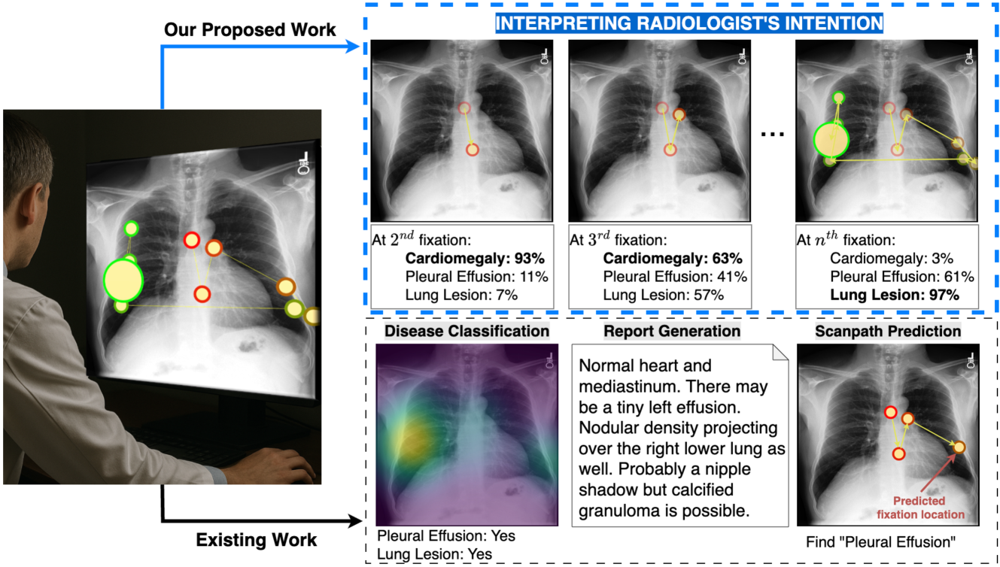
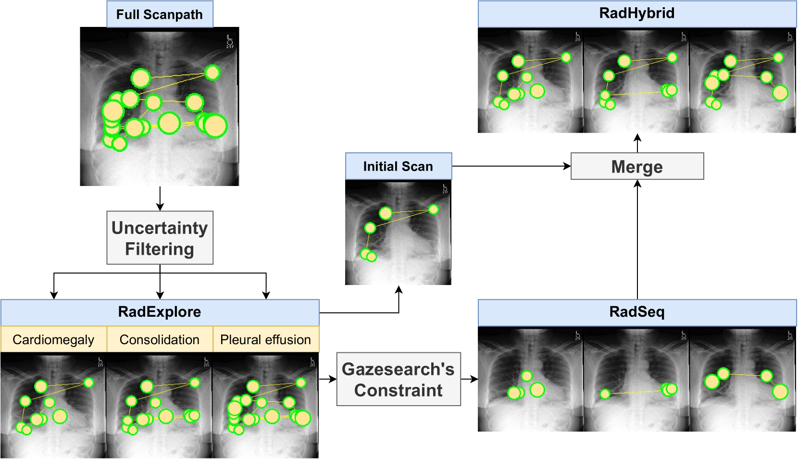

# RadGazeIntent: Interpreting Radiologist's Intention from Eye Movements in Chest X-ray Diagnosis

<div align="center">

[](https://arxiv.org/abs/2507.12461)
[](https://arxiv.org/abs/2507.12461)
[](https://huggingface.co/datasets/phamtrongthang/GazeIntent)
[](https://creativecommons.org/licenses/by-nc-sa/4.0/)

</div>
<p align="center">
  
</p>

**RadGazeIntent** is a deep learning framework that interprets the diagnostic intentions behind radiologists' eye movements during chest X-ray analysis. Unlike existing approaches that mimic radiologist behavior, our method decodes the *why* behind each fixation point, bridging visual search patterns with diagnostic reasoning.


🎉 **Paper accepted at ACM MM 2025** - A top-tier international conference on multimedia research

## 🛠️ Installation


### Setup Environment

```bash
# Remove existing environment (if any)
conda env remove --name radgazeintent

# Create new environment
conda create -n radgazeintent python=3.8 -y
conda activate radgazeintent

# Install PyTorch and dependencies
conda install pytorch==1.10.0 torchvision==0.11.0 cudatoolkit=11.3 -c pytorch -y
conda install mkl==2024.0
conda install -c conda-forge cudatoolkit-dev=11.3.1

# Install Detectron2
pip install 'git+https://github.com/facebookresearch/detectron2.git'

# Build custom CUDA operations
cd ./radgazeintent/pixel_decoder/ops
sh make.sh

# Install additional dependencies
pip install uv 
uv pip install timm scipy opencv-python wget setuptools==59.5.0 einops protobuf==4.25.0
```

## 📊 Datasets

RadGazeIntent introduces three intention-labeled datasets derived from existing eye-tracking datasets ([EGD](https://physionet.org/content/egd-cxr/1.0.0/) and [REFLACX](https://physionet.org/content/reflacx-xray-localization/1.0.0/)):

📥 **Download**: All three datasets are available on [🤗 Hugging Face](https://huggingface.co/datasets/phamtrongthang/GazeIntent)

### 🔄 RadSeq (Systematic Sequential Search)
Models radiologists following a structured checklist, focusing on one finding at a time.

### 🔍 RadExplore (Uncertainty-driven Exploration) 
Captures opportunistic visual search where radiologists consider all findings simultaneously.

### 🔄🔍 RadHybrid (Hybrid Pattern)
Combines initial broad scanning with focused examination, representing real-world diagnostic behavior.

<p align="center">
  
</p>

## 🚀 Quick Start

### Training

```bash
# Train RadGazeIntent on RadSeq dataset
python train.py \
    --hparams configs/train_for_real_egd_s2.json \
    --dataset-root /path/to/your/dataset \
    --gpu-id 0

# Train on RadExplore dataset  
python train.py \
    --hparams configs/train_for_real_reflacx_s2.json \
    --dataset-root /path/to/your/dataset \
    --gpu-id 0
```

### Inference

```bash
# Run inference on all test datasets
python infer_all.py \
    --hparams configs/infer_egd_s2.json \
    --dataset-root /path/to/your/dataset \
    --gpu-id 0

# Quick inference with shell script
bash infer.sh
```


## 🎯 Applications

RadGazeIntent enables several downstream applications:

- **🤖 Intention-aware AI Assistants**: Systems that understand what radiologists are looking for
- **📚 Medical Education**: Training tools that analyze student gaze patterns  
- **🔬 Cognitive Research**: Understanding expert visual reasoning processes

## 📄 Citation

If you find RadGazeIntent useful in your research, please consider citing:

```bibtex
@article{pham2025interpreting,
  title={Interpreting Radiologist's Intention from Eye Movements in Chest X-ray Diagnosis},
  author={Pham, Trong-Thang and Nguyen, Anh and Deng, Zhigang and Wu, Carol C and Van Nguyen, Hien and Le, Ngan},
  journal={arXiv preprint arXiv:2507.12461},
  year={2025}
}
```

<div align="center">

**⭐ Star this repository if you find it useful! ⭐**

</div>

## 📜 License

This project is licensed under the Creative Commons Attribution-NonCommercial-ShareAlike 4.0 International License - see the [LICENSE](LICENSE) file for details.

## 🙏 Acknowledgments
This material is based upon work supported by the National Science Foundation (NSF) under Award No OIA-1946391, NSF 2223793 EFRI BRAID, National Institutes of Health (NIH) 1R01CA277739-01.

- **Datasets**: Built upon [EGD](https://physionet.org/content/egd-cxr/1.0.0/) and [REFLACX](https://physionet.org/content/reflacx-xray-localization/1.0.0/) eye-tracking datasets
- **Backbone**: Uses [Detectron2](https://github.com/facebookresearch/detectron2) for feature extraction
- **Inspiration**: Motivated by cognitive science research on expert visual reasoning

## 📞 Contact
**Primary Contact**: Trong Thang Pham (tp030@uark.edu)

For questions, feedback, or collaboration opportunities, feel free to reach out! I would love to hear from you if you have any thoughts or suggestions about this work.

**Note**: While we don't actively seek contributions to the codebase, we greatly appreciate and welcome feedback, discussions, and suggestions for improvements.

## 📝 TODO

- [ ] Improve code structure and modularity for better maintainability
- [ ] Expand documentation with detailed tutorials and examples
- [ ] Docker Support: Add containerized deployment options

